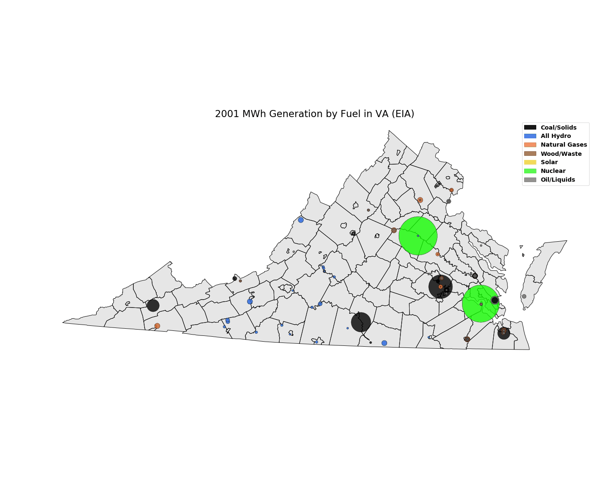

# fuel_through_time
 
 

## Intro
This repo contains the code and data for making a map (in gif form) of generation by Virginia power plants 2001-2019. The plotted circles are colored by fuel type and sized by the amount of generation. 
While the data in this repo is only for Virginia, the script I used to go through the EIA's API and collect the data is also included, as well as a reference file from EIA form-860 and a national version of the virginia data. 
Let's run everything down.


## Data Collection
I've already done some manual processing with the full EIA-860 form and placed that output in this repository. That form has data on individual generators, including their location. It also has proposed and canceled or retired plants. I collated those tables into one file and also added a "color" column for a different project, which I use here as well. These colors are assigned based on the "Reported Fuel Type Code" which you can find in the File Layout tab of EIA forms that contain fuel codes. However, Form-860 only has capacity, and the annual 923 forms are too tedious to grab individually for fuel and generation, so we turn to the API.

[The EIA API](https://www.eia.gov/opendata/) is pretty easy to use, particularly since a few excellent humans have already written python wrappers for it. After you've gotten your API key, you can pip or conda install EIA_python, the package I'm using here. The "process_eia.py" file contains the code to pull generation for every year available for each plant. The list of calls in constructed from a plant+fuel combo list I made from the EIA form data. I also fold in lat and lon data from EIA-860 so that we can have one file with plants, fuels, and their coordinates, which are necessary to plot/map them. 

To change the state output, you can change the second line below to either filter to a different state or remove the filter and pull data for every plant in the country.

```python
plantRef = pd.read_csv(localPath+"plants_fuels_together.csv")
vaPlants = plantRef[plantRef['state'] == 'VA']
```

I do have one error exception in this API handling, which should only trigger for plants that are in my underlying data, but havne't been bulit yet and therefore don't exist in the fuel/generation API data evne though they have a plant code and location. 

## A bit on the geograpy portion
The gis_data filder has a shapefile of counties in Virginia. You'll want a shapefile of whatever geography you're working with. If you don't know what a shapefile is, you can download QGIS for free and start messing around with GIS. Most data-heavy federal offices/deparments will have a bunch of shapefiles (BLS, [EIA](https://www.eia.gov/maps/layer_info-m.php), [Census](https://www.census.gov/geographies/mapping-files/time-series/geo/carto-boundary-file.html)) available for free, as will your state and often your local town or county these days with [open data portals](https://gisdata-arlgis.opendata.arcgis.com/). 

There are two potential pain areas with this code, and the shapefile/GIS management is one of them. It's very easy to mess up the cartographic projections piece and end up with a blank or broken map. Fortunately, you will get an error from geopandas in the console (althought he code *will* keep running), so typically you know what's gone wrong. Despite knowing your crs is messed up, it's still easy to lose track of what coordinate system everything is in. It's easiest to handle it up front with every new piece of geigraphic data you create or import.  You can check the crs on an imported shapefile with ".crs". 

In the example below, I'm importing a shapefile of Virginia counties, putting it into the GeoDataframe format, checking the crs, and then converting it to the project crs I want to use:

```python
import geopandas as gpd 

dataSource  = 'local path name'
vaShape = gpd.read_file(dataSource+"gis_data\va_counties.shp")
vaShape2 = gpd.GeoDataFrame(vaShape,geometry='geometry',crs={'init':'epsg:4269'})
vaShape2.crs
vaShape3 = vaShape2.to_crs("epsg:32618")
```

EPSG:32618 is actually not a great crs for Virginia, but I was repurposing this code from something else, and since I knew it worked just kept using that. An easy upgrade would be to change the crs to something more locally relelvant.


## Setting  up the environment
The other major potential issue is just the geopandas working environment. Geopandas can be a bit finicky. Sometimes I have no issue with my local installation in a WinPython folder that I installed with "pip install geopandas", but other times it kills the kernel in odd ways. The safest and msot reliable way I've found to execute different geopandas code is to set up a specific environment with an Anaconda installation. [I used the instructions in the geopandas docs](https://geopandas.org/install.html) and that has worked great so far. One thing to be aware of is that I do use a few additional libraries/packages (ImageMagick, ffmpeg) for the gif processing, and you'll want to make sure those are installed in the geo_env you set up so that they're accessible to the environment. 

You might not need to set up an environment. This piece of code has been fine for me to run in just my regular installation, but when I do something more complicated, like a [grouping of generation into a hex overlay](https://twitter.com/ConnorWaldoch/status/1279159266788737024?s=20) it crashes 100% of the time unless it's in the prepared geopandas environment. 


## Plot Visualization
This part really depend son your mindset: what you're trying to convey and what you think looks good. You can completely modify how the circles are sized, their colors, transparencies, whether or not they have a border, etc. The circle size is one of the trickiest things to get right, and may require some manual examination of the underlying data along with a lot of iteration. Typically, there are 2 ways to determine the size:

1). Apply one formula to everything, e.g., size = generation*1000
2). Decide breakpoints and manually classify, e.g., if generation > 10 then size is 1000, generation > 20 size is 2000, etc.

The range here is really big, so I end up doing both. From my perspetive, I want to show every plant, even if they didn't run, to show that they exist. I classify the first few generation ranges, then apply a formula to everything over 250,000MWh. 

```python            
	if sumMW >= 0:
		cSize = 500
	if sumMW >= 5000:
		cSize = 1000
	if sumMW >= 25000:
		cSize = 1000
	if sumMW >= 75000:
		cSize = 1000  
	if sumMW >= 250000:
		cSize = normBubble(sumMW) * 25000

	hexCircle = singlePoint.buffer(cSize)
    ```